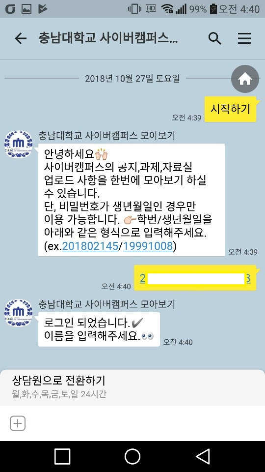
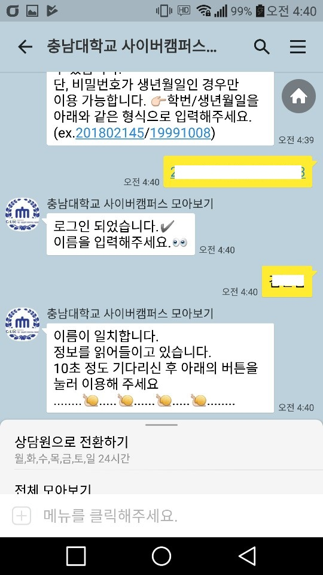
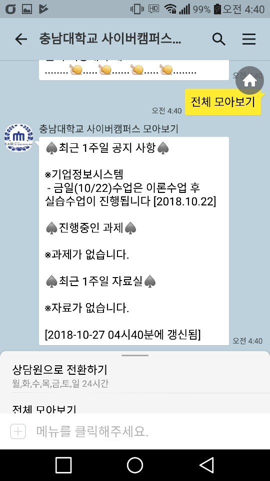
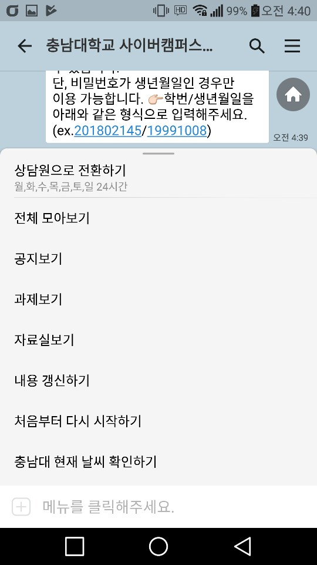

# Django를 이용한 사이버캠퍼스 모아보기 카카오봇
* 충남대학교 사이버캠퍼스 사이트의 공지사항,자료실,과제 게시판에 업로드 된 사항들을 한번에 모아보기 해주는 봇입니다. 

## 플러스친구 바로가기
[](https://pf.kakao.com/_eeafC)

## 개발환경
* Python 3.5.3
* Django Framework 2.0.4
* sqlite3 3.16.2

## HTML parser library
* beautifulsoup4 4.6.3

## Server
* raspberrypi3

## 주요 코드
### 1.view.py
1-1.keyboard
  ```
  def keyboard(request):
	
	return JsonResponse(
	{
	  'type': 'buttons',
	  'buttons' : ['시작하기']
	}
  )
  ```
1-2.message 일부
  ```
  @csrf_exempt 
def message(request):
	
	json_str = (request.body).decode('utf-8')
	received_json = json.loads(json_str)
	content_name = received_json['content']
	userID = received_json['user_key']
	registered_user=False
	try:
		row = MY_HOME.objects.get(pk=userID)
		registered_user=True
	except Exception as e:
		print(e)

	p = re.compile('\d{9}/\d{8}') # 학번 정규표현
	m = p.match(content_name)


	if content_name =="시작하기":
		if registered_user:

			if row.studentNum =="학번/생년월일":
				return JsonResponse(
					{
						'message': {
							'text': "사용자가 '나'일때 특별 메시지 보여줌.."
						},
						'keyboard': {
							'type': 'buttons',
							'buttons': ['전체 모아보기', '공지보기', '과제보기', '자료실보기', '내용 갱신하기', '처음부터 다시 시작하기',
										'충남대 현재 날씨 확인하기']
						}

					}
				)
			else:
				return JsonResponse(
					{
						'message': {
							'text': "★"+row.name+"님 환영합니다.★"
						},
						'keyboard': {
							'type': 'buttons',
							'buttons': ['전체 모아보기', '공지보기', '과제보기', '자료실보기', '내용 갱신하기', '처음부터 다시 시작하기',
										'충남대 현재 날씨 확인하기']
						}

					}
				)
		else:
			return JsonResponse(
				{
					'message':{
						'text': '안녕하세요🙌\n사이버캠퍼스의 공지,과제,자료실 업로드 사항을 한번에 모아보기 하실 수 있습니다.\n단, 비밀번호가 생년월일인 경우만 이용 가능합니다. 👉학번/생년월일을 아래와 같은 형식으로 입력해주세요.(ex.201802145/19991008)'
					}
				}
			)
	if content_name=="처음부터 다시 시작하기":
		return JsonResponse(
			{
				'message':{
					'text': '안녕하세요🙌\n사이버캠퍼스의 공지,과제,자료실 업로드 사항을 한번에 모아보기 하실 수 있습니다.\n단, 비밀번호가 생년월일인 경우만 이용 가능합니다. 👉학번/생년월일을 아래와 같은 형식으로 입력해주세요.(ex.201802145/19991008)'
				}
			}
		)
  ```
### 2.Login.py
 * 학생의 강의 정보를 가져오기 위해 로그인이 필요하다. 처음 한 번 로그인을 하면 이후에는 DB에서 카카오톡 키값과 대조하여 자동으로 사용자정보를 가져온다. 
  ```
  def login(input_id,state,userID): #사이버캠퍼스에 로그인
	with requests.Session() as s:
		global my_name,my_major
		d = input_id.split("/")[0]
		pw = input_id.split("/")[1]
		LOGIN_INFO_2['user_id'] = id
		LOGIN_INFO_2['user_password'] = pw
		req = s.post('http://e-learn.cnu.ac.kr/login/doGetUserCountId.dunet', data=LOGIN_INFO_2)
		try:
			data = req.json()
			print(data["MSG"])
			if data['MSG']=="아이디 또는 패스워드정보가 잘못됐습니다.":
				print("로그인실패")
				return False
			else:
				print("로그인성공")
		except KeyError as e:
			print(e)

		req = s.get('http://e-learn.cnu.ac.kr/main/MainView.dunet')
		soup = bs(req.text, 'html.parser')
		p = re.compile("user_name = '\w*'")  ##정규포현식 사용
		p2 = re.compile("deptGroup = '\w*'")
		m = p.findall(soup.text)
		m2 = p2.findall(soup.text)

		if state:
			my_name = m.__getitem__(0).split("'")[1] #이름
			my_major = m2.__getitem__(0).split("'")[1] #학과
		if not state:
			proc = Process(target=test_bot.main,args=(input_id,userID,s))
			proc.start()
		return True
  ```
### 3.Homework.py 일부
  ```
  def my_homework_list_fuc(soup,my_corse_name): #모든 과제 내용 파싱
        # 과제 리스트 가져오기
        homework_table = soup.find('table', {'class': 'datatable mg_t15'})
        homework_table_body = homework_table.find('tbody')
        rows = homework_table_body.find_all('tr')
        for row in rows:
            cols = row.find_all('td')
            cols = [ele.text.strip() for ele in cols]
            cols.insert(0, my_corse_name)
            my_homework.append([ele for ele in cols if ele]) # Get rid of empty values
  ```
## 실행 결과






